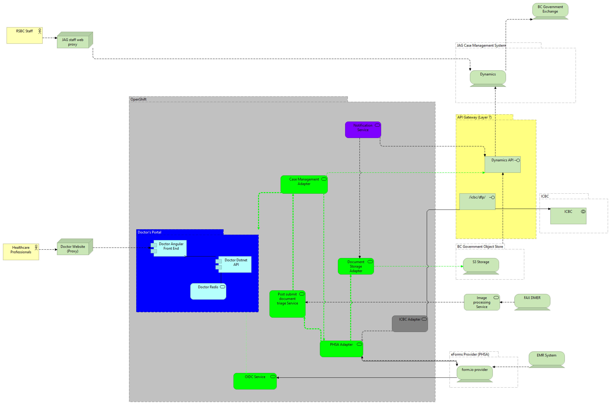

Road Safety BC Driver Medical Fitness
======================

Technology Stack
-----------------

| Layer   | Technology | 
| ------- | ------------ |
| Presentation | Angular 11 |
| Business Logic | C Sharp - Dotnet Core 5.0 |
| Microservices | C Sharp - Dotnet Core 5.0 |
| Front End Web Server | Caddy |
| Application Server | Kestrel |
| Data Storage | MS Dynamics On Premise V9 |
| Authentication | ADFS, BC Services Card |
| Document Storage    | S3 |
| Container Platform | OpenShift 4 |
| Zero Trust Security Policy Type | Kubernetes |
| Logging | Splunk, Console, and Kibana |
| CI/CD Pipeline | Jenkins |

System Architecture
--------------

Repository Map
--------------

- **functional-tests**: Source for BDD tests
- **openshift**: Various OpenShift related material, including instructions for setup and templates.

Installation
------------
This application is meant to be deployed to RedHat OpenShift version 4. Full instructions to deploy to OpenShift are in the `openshift` directory.

Developer Prerequisites
-----------------------

**Public Application**
- .Net Core SDK (5.0)
- Node.js 
- .NET Core IDE such as Visual Studio or VS Code
- JAG VPN with access to MS Dynamics

**DevOps**
- RedHat OpenShift tools
- Docker
- A familiarity with Jenkins

Microsoft Dynamics, SharePoint
---------------------------
A MS Dynamics instance containing the necessary solution files is required.  A SharePoint connection is optional.  If no SharePoint connection is available then file operations will not be executed.

Define the following secrets in your development environment (secrets or environment variables):
1. DYNAMICS_NATIVE_ODATA_URI: The URI to the Dynamics Web API endpoint.  Example:  `https://<hostname>/<tenant name>/api/data/v9.0/`.  This URI can be a proxy.
2. DYNAMICS_NATIVE_ODATA_URI: The native URI to the Dynamics Web API endpoint, in other words as the server identifies itself in responses to WebAPI requests.  Do not put a proxy URI here.
3. SSG_USERNAME: API gateway username, if using an API gateway
4. SSG_PASSWORD: API gateway password, if using an API gateway
5. DYNAMICS_AAD_TENANT_ID: ADFS Tenant ID, if using ADFS authentication.  Leave blank if using an API gateway
6. DYNAMICS_SERVER_APP_ID_URI: ADFS Server App ID URI. Leave blank if using an API gateway
7. DYNAMICS_CLIENT_ID: Public Key for the ADFS Enterprise Application app registration. Leave blank if using an API gateway
8. SHAREPOINT_ODATA_URI: Endpoint to be used for SharePoint, exclusive of _api.  Can be a proxy.  Leave blank if not using SharePoint.
9. SHAREPOINT_NATIVE_BASE_URI:  The SharePoint URI as configured in SharePoint.  Do not set to a proxy.
10. SHAREPOINT_SSG_USERNAME, SHAREPOINT_SSG_PASSWORD - optional API Gateway credentials for SharePoint
11. SharePoint may also use the same ADFS credentials as Dynamics.  If that is to be used, leave all SSG parameters empty or undefined.

DevOps Process
-------------

## Jenkins

This project does not use Jenkins.  It does use GitHub Actions and Tekton (Kubernetes) pipelines.

## DEV builds
Dev builds are triggered by source code being committed to the repository.  This process triggers a github action.

Login to Github and view the "Actions" tab of this repository to see status of recent runs.

## Promotion to TEST
To promote code to TEST, login to OpenShift and start the Kubernetes Pipeline for Promote to Test.

## Promotion to TRAIN
To promote code to TRAIN, login to OpenShift and start the Kubernetes Pipeline for Promote to Train.

## Promotion to PROD
To promote code to PROD, login to OpenShift and start the Kubernetes Pipeline for Promote to Prod. Not that this pipeline will also make a backup of the current PROD deployment.

## Restore PROD from backup
If you wish to revert to the previous PROD deployment, login to OpenShift and start the Kubernetes Pipeline for Restore PROD from Backup.

Contribution
------------

Please report any [issues](https://github.com/bcgov/https://github.com/bcgov/rsbc-dmf/issues).

[Pull requests](https://github.com/bcgov/rsbc-dmf/pulls) are always welcome.

If you would like to contribute, please see our [contributing](CONTRIBUTING.md) guidelines.

Please note that this project is released with a [Contributor Code of Conduct](CODE_OF_CONDUCT.md). By participating in this project you agree to abide by its terms.

License
-------

    Copyright 2021 Province of British Columbia

    Licensed under the Apache License, Version 2.0 (the "License");
    you may not use this file except in compliance with the License.
    You may obtain a copy of the License at 

       http://www.apache.org/licenses/LICENSE-2.0

    Unless required by applicable law or agreed to in writing, software
    distributed under the License is distributed on an "AS IS" BASIS,
    WITHOUT WARRANTIES OR CONDITIONS OF ANY KIND, either express or implied.
    See the License for the specific language governing permissions and
    limitations under the License.

Maintenance
-----------

This repository is maintained by [BC Attorney General]( https://www2.gov.bc.ca/gov/content/governments/organizational-structure/ministries-organizations/ministries/justice-attorney-general ).

